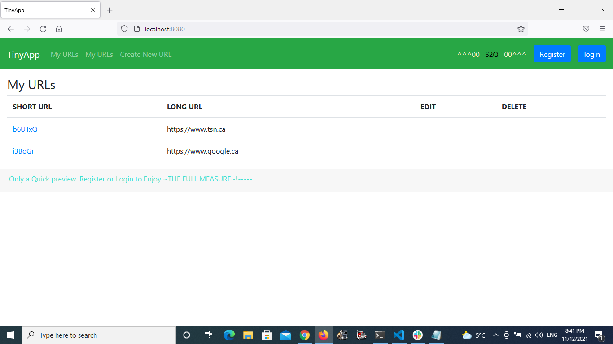
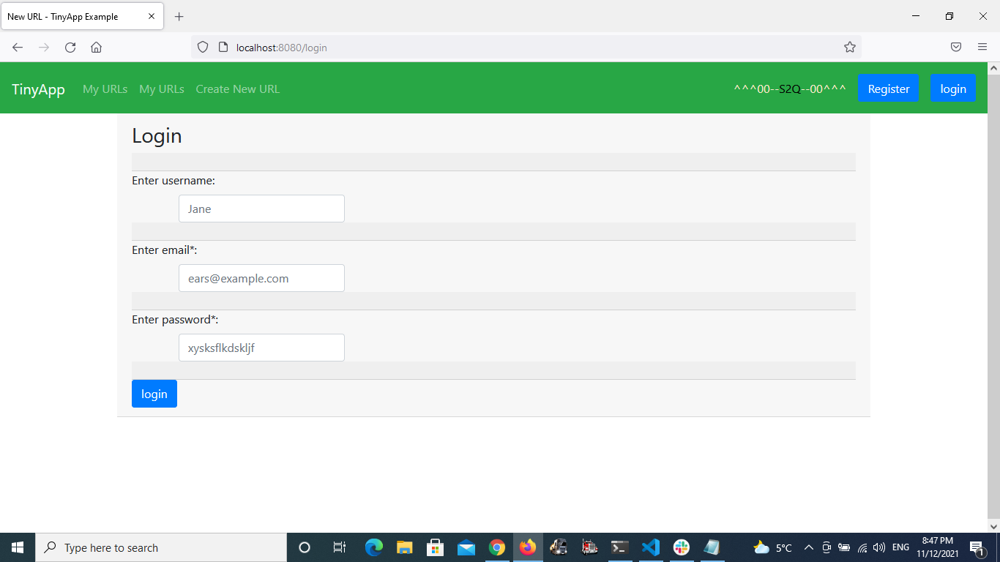
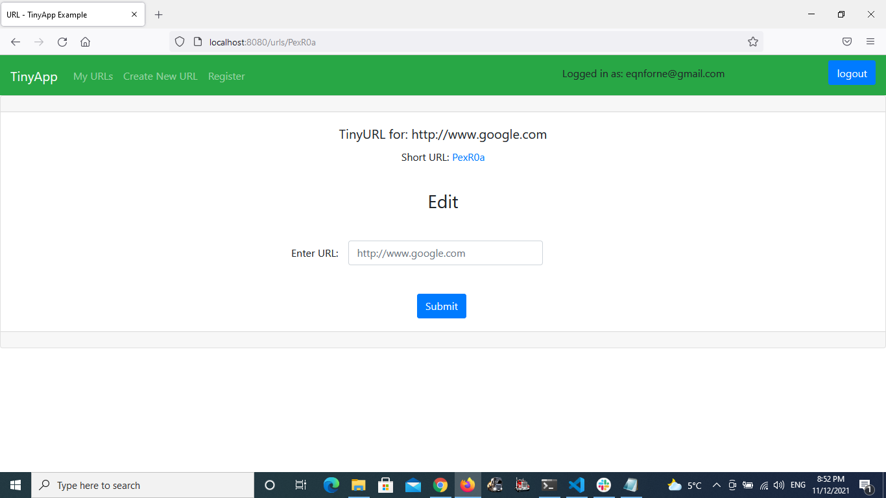
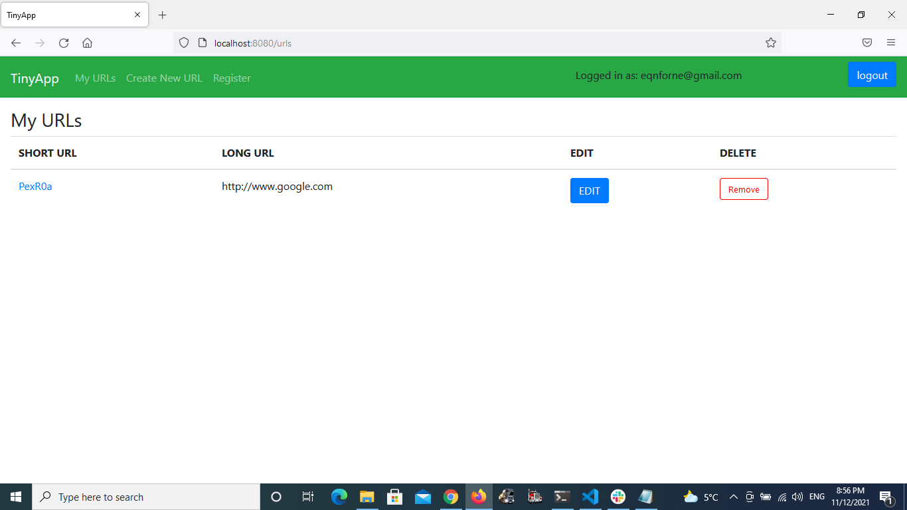

#### TinyApp
## A simple secure web application to grant registered users private space to keep a collection of their urls in shortened form.

### How to run it!
* npm i /*dependency*/
* /*Its a Node.js and Express.js App. So you'll need to install those to run it plus the following: [check package.json to confirm]*/
- -bcrypt
- -body-parser
- -cookie-session
- -ejs
- -express
- -method-override any other Node packages you may have.

## /*Open to improvements and further addaptions*/

